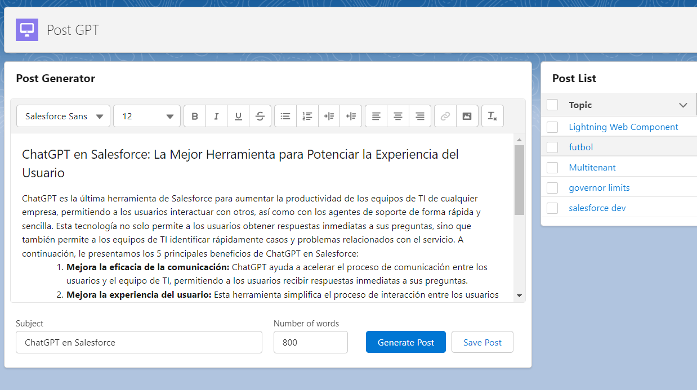

# Lightning Web Component with OpenAI

Lightning Web Component that connects open ai to generate blog posts by a subject.
Author: Gian Vallejos
Date: 30/04/2023

#Lightning Web Component with ChatGPT

# Steps to configurate the application

## Create API_KEY:

- Go to https://platform.openai.com/
- Register for free
- Click on your profile picture / View API keys
- Set any name
- Copy the key and paste it in Setup / Custom Labels / OpenAI_API_KEY
- Save it

## Create Custom Labels:

- Right click on force-app/main/default/labels/CustomLabels.labels-meta.xml
- Select SFDX: Deploy source to org

## Create Post\_\_c Object:

- Right click on force-app/main/default/objects
- Select SFDX: Deploy source to org

## Create messageChannels:

- Right click on force-app/main/default/messageChannels
- Select SFDX: Deploy source to org

## Create Apex Class:

- Right click on force-app/main/default/classes
- Select SFDX: Deploy source to org

## Create LWC:

- Right click on force-app/main/default/lwc
- Select SFDX: Deploy source to org

## Configure Remote API:

- Go to the Setup gear.
- Search for "Remote Site Settings"
- Add the API: https://api.openai.com

## Final Steps:

Add Lightning Web Components to your App Page

## Contact Me

Test it. If there is any problem. Please contact me on: https://www.linkedin.com/in/gianvallejos/ or "Hablemos de Salesforce" Youtube Channel.
